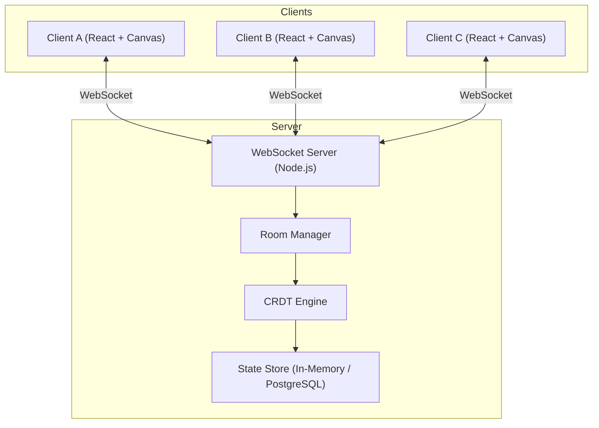
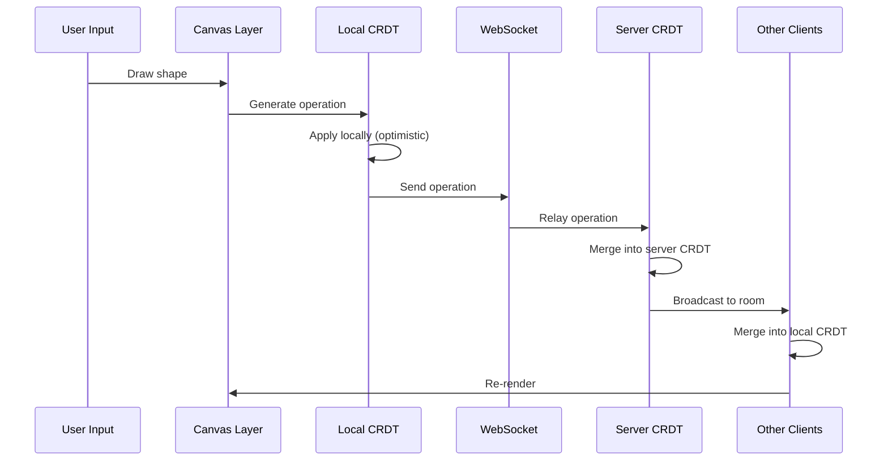

# 🏛️ Architecture

## High-Level Overview



## Data Flow



## Key Architecture Decisions

| Decision | Choice | Rationale |
|---|---|---|
| Sync Model | CRDT (not OT) | No central ordering required, works offline |
| Transport | WebSocket | Full-duplex, low latency |
| Rendering | HTML5 Canvas | Direct pixel control, 60fps performance |
| State Shape | Flat map of shapes by ID | Simple CRDT merge, O(1) lookups |
| Persistence | In-memory → PostgreSQL | Start simple, add durability later |

## Module Boundaries

```
frontend/
├── src/
│   ├── canvas/       # Canvas rendering engine
│   ├── crdt/         # Client-side CRDT state
│   ├── network/      # WebSocket connection manager
│   ├── tools/        # Drawing tools (pen, shapes, text)
│   ├── ui/           # React UI components
│   └── types/        # Shared TypeScript types

backend/
├── src/
│   ├── rooms/        # Room lifecycle management
│   ├── crdt/         # Server-side CRDT engine
│   ├── network/      # WebSocket handler
│   ├── storage/      # Persistence layer
│   └── types/        # Shared TypeScript types
```

---

> This document is updated as new features are added.
