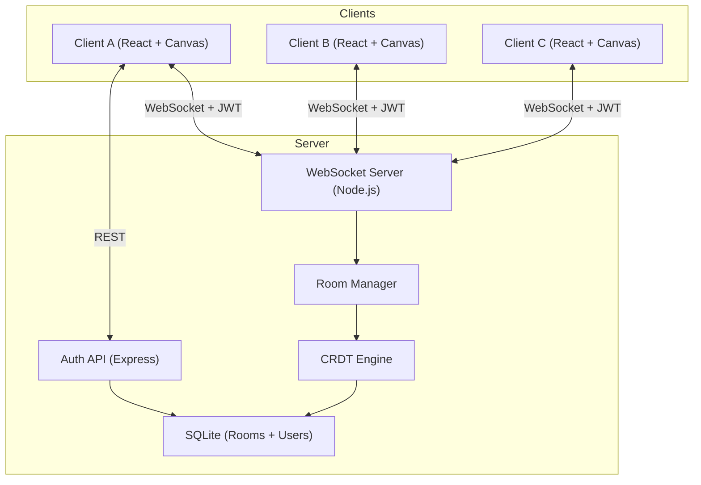
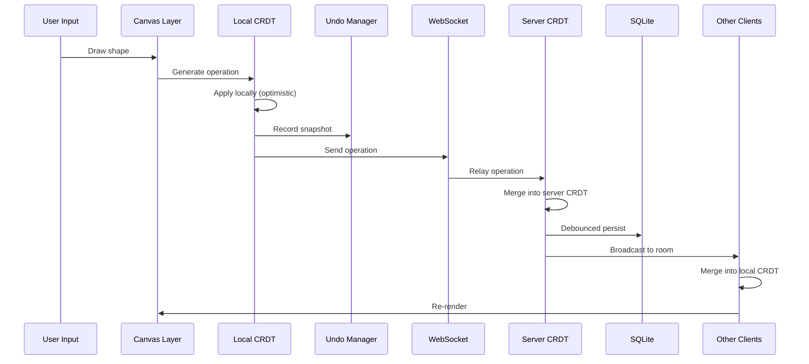
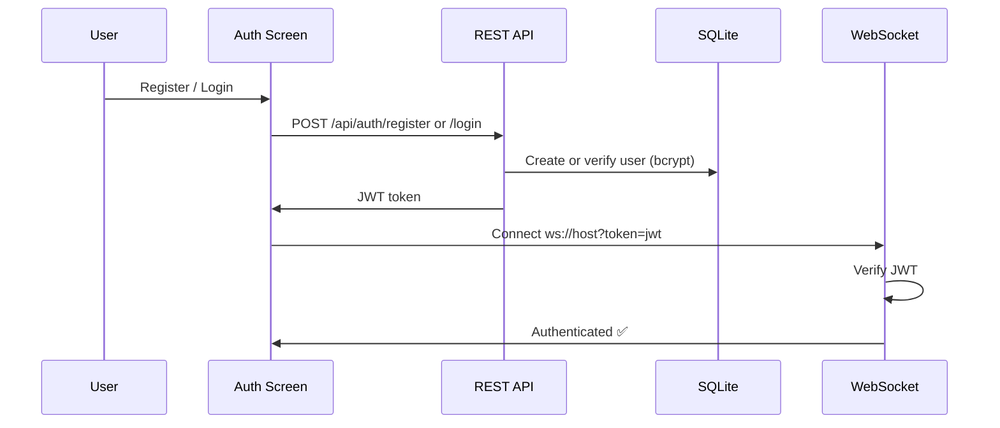

# 🏛️ Architecture

## High-Level Overview


```mermaid
graph TB
    subgraph Clients
        C1["Client A (React + Canvas)"]
        C2["Client B (React + Canvas)"]
        C3["Client C (React + Canvas)"]
    end

    subgraph Server
        AUTH["Auth API (Express)"]
        WS["WebSocket Server (Node.js)"]
        RM[Room Manager]
        CRDT[CRDT Engine]
        STORE["SQLite (Rooms + Users)"]
    end

    C1 <-->|REST| AUTH
    C1 <-->|WebSocket + JWT| WS
    C2 <-->|WebSocket + JWT| WS
    C3 <-->|WebSocket + JWT| WS
    AUTH --> STORE
    WS --> RM
    RM --> CRDT
    CRDT --> STORE
```

## Data Flow


```mermaid
sequenceDiagram
    participant User as User Input
    participant Canvas as Canvas Layer
    participant CRDT as Local CRDT
    participant Undo as Undo Manager
    participant WS as WebSocket
    participant Server as Server CRDT
    participant DB as SQLite
    participant Peers as Other Clients

    User->>Canvas: Draw shape
    Canvas->>CRDT: Generate operation
    CRDT->>CRDT: Apply locally (optimistic)
    CRDT->>Undo: Record snapshot
    CRDT->>WS: Send operation
    WS->>Server: Relay operation
    Server->>Server: Merge into server CRDT
    Server->>DB: Debounced persist
    Server->>Peers: Broadcast to room
    Peers->>Peers: Merge into local CRDT
    Peers->>Canvas: Re-render
```

## Authentication Flow


```mermaid
sequenceDiagram
    participant User as User
    participant UI as Auth Screen
    participant API as REST API
    participant DB as SQLite
    participant WS as WebSocket

    User->>UI: Register / Login
    UI->>API: POST /api/auth/register or /login
    API->>DB: Create or verify user (bcrypt)
    API->>UI: JWT token
    UI->>WS: Connect ws://host?token=jwt
    WS->>WS: Verify JWT
    WS->>UI: Authenticated ✅
```

## Key Architecture Decisions

| Decision | Choice | Rationale |
|---|---|---|
| Sync Model | CRDT (not OT) | No central ordering required, works offline |
| Transport | WebSocket | Full-duplex, low latency |
| Rendering | HTML5 Canvas | Direct pixel control, 60fps performance |
| State Shape | Flat map of shapes by ID | Simple CRDT merge, O(1) lookups |
| Persistence | SQLite (via better-sqlite3) | Zero setup, ACID, single-file database |
| Auth | JWT + bcrypt | Stateless tokens, secure password hashing |
| Offline | IndexedDB queue + auto-reconnect | CRDTs guarantee safe replay of buffered ops |
| Undo/Redo | Local snapshot stack | Simpler than CRDT-based undo, matches user expectations |

## Module Boundaries

```
frontend/
├── src/
│   ├── canvas/       # Canvas rendering engine
│   ├── crdt/         # Client-side CRDT state + UndoManager
│   ├── hooks/        # React hooks (usePresence)
│   ├── network/      # WebSocket connection manager
│   ├── storage/      # IndexedDB offline queue
│   ├── tools/        # Drawing tools (pen, shapes, text, select)
│   ├── ui/           # React UI components (Auth, Canvas, Toolbar, Export, Presence)
│   └── types/        # Shared TypeScript types

backend/
├── src/
│   ├── auth/         # JWT authentication (controller + middleware)
│   ├── rooms/        # Room lifecycle management
│   ├── crdt/         # Server-side CRDT engine
│   ├── network/      # WebSocket handler
│   ├── storage/      # SQLite persistence (rooms + users)
│   └── types.ts      # Shared TypeScript types
```

---

> This document is updated as new features are added.
