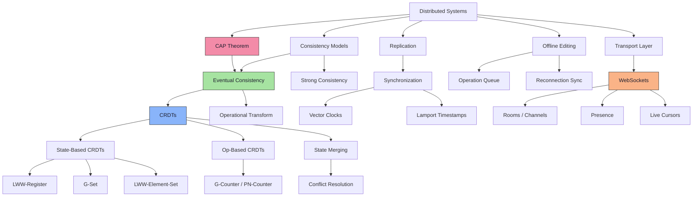

# 🧬 Knowledge Graph

> Maps how distributed systems concepts connect and which lessons cover them.

## Concept → Lesson Mapping

| Concept | Lesson | Status |
|---|---|---|
| CAP Theorem | Lesson 1 | 📖 In Progress |
| Eventual Consistency | Lesson 1 | 📖 In Progress |
| CRDTs vs OT | Lesson 1 | 📖 In Progress |
| State-Based CRDTs | Lesson 3 (planned) | ⏳ Planned |
| Op-Based CRDTs | Lesson 3 (planned) | ⏳ Planned |
| WebSockets | Lesson 2 (planned) | ⏳ Planned |
| Rooms | Lesson 2 (planned) | ⏳ Planned |
| Vector Clocks | Lesson 3 (planned) | ⏳ Planned |
| Offline Editing | Lesson 5 (planned) | ⏳ Planned |

---

> Updated as new concepts are introduced.
