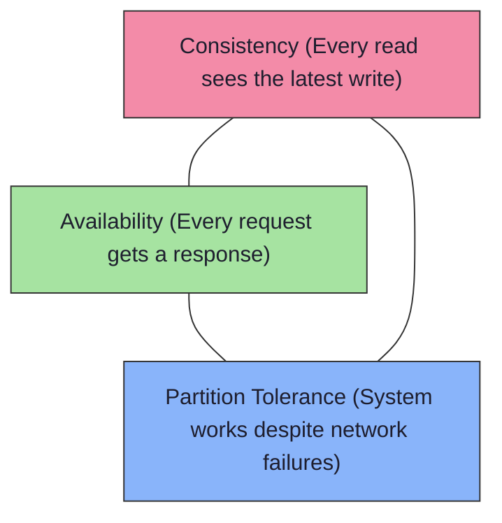
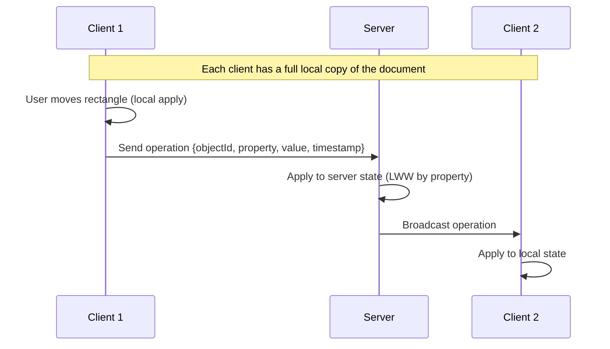
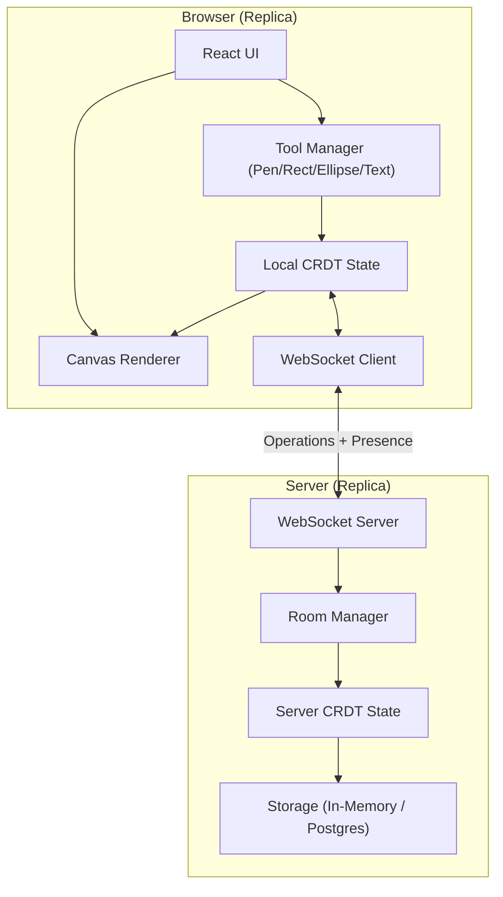
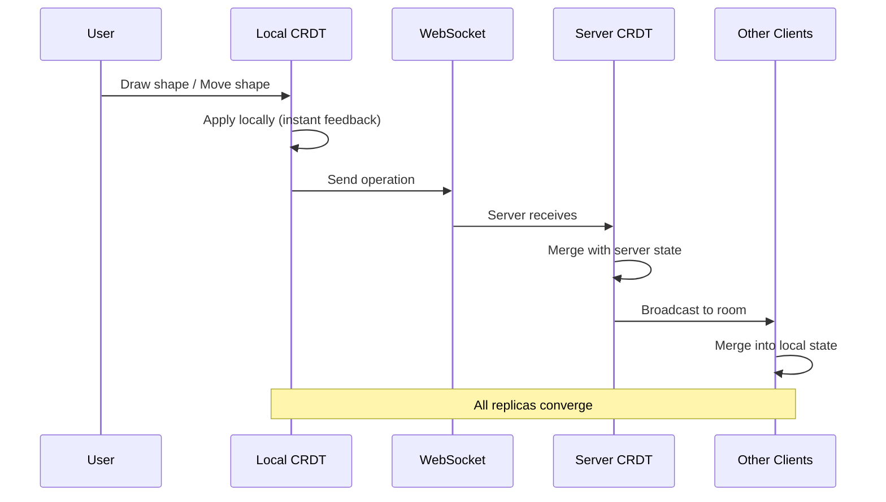
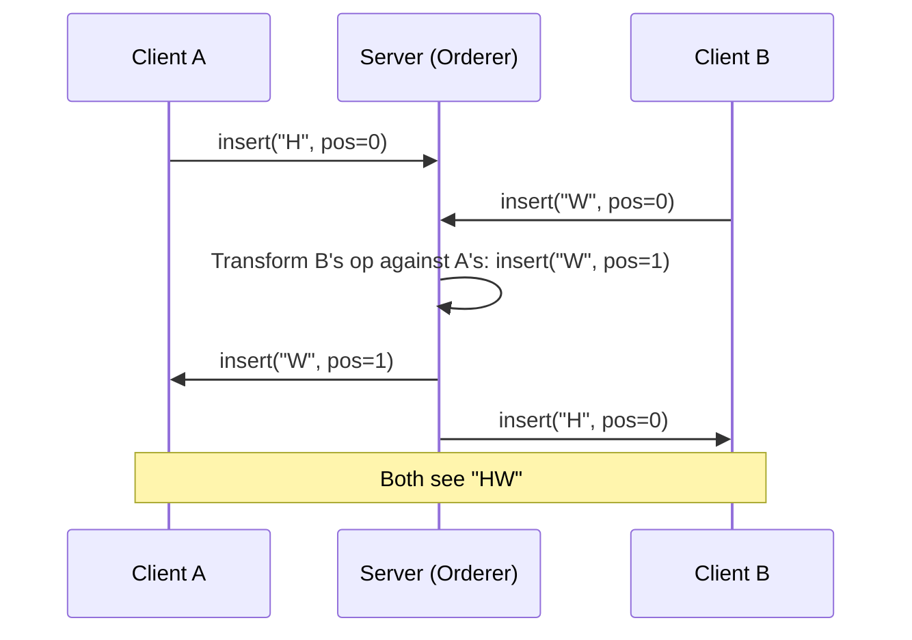
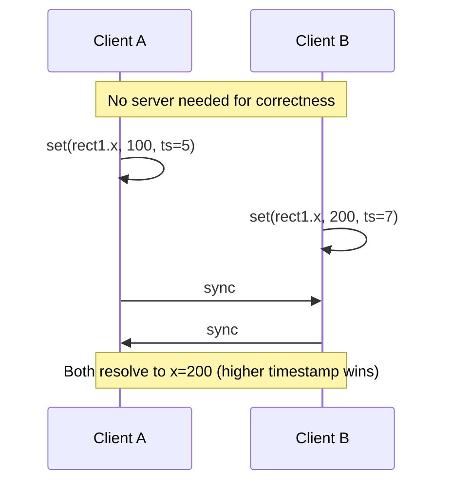
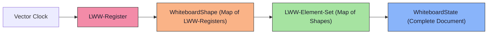

# Lesson 1: Introduction to Distributed State & CRDTs

> **Goal**: Before writing a single line of synchronization code, you must understand *why* keeping state consistent across multiple clients is one of the hardest problems in computer science — and why CRDTs are our weapon of choice.

---

## Table of Contents

1. [The Core Problem](#the-core-problem)
2. [ELI12: The Shared Notebook](#eli12-the-shared-notebook)
3. [University: Distributed Systems Foundations](#university-distributed-systems-foundations)
4. [Industry: How Real Products Handle This](#industry-how-real-products-handle-this)
5. [How Figma Solves It](#how-figma-solves-it)
6. [How We Simplify It](#how-we-simplify-it)
7. [Architecture](#architecture)
8. [CRDTs vs Operational Transform — Deep Dive](#crdts-vs-operational-transform--deep-dive)
9. [CRDT Types We Will Build](#crdt-types-we-will-build)
10. [Exercises](#exercises)
11. [Quiz](#quiz)
12. [Interview Questions](#interview-questions)
13. [Cheat Sheet](#cheat-sheet)

---

## The Core Problem

Imagine two people are editing the same whiteboard at the same time. Alice draws a circle. Bob draws a square. Both are editing *their own copy* of the canvas. Now: **how do you merge their changes so both see the same result?**

This sounds simple, but it's the central challenge of *every* collaborative application — Google Docs, Figma, Notion, multiplayer games, distributed databases.

The problem breaks down into:

1. **Concurrency**: Multiple users editing simultaneously.
2. **Latency**: Network messages take time to arrive.
3. **Partitions**: Users may go offline.
4. **Ordering**: Who "wins" when two edits conflict?
5. **Convergence**: All users must eventually see the *same* state.

---

## ELI12: The Shared Notebook

> *Imagine you and your friend each have a copy of the same notebook.*

You're both drawing on your own copy at the same time. You draw a sun on page 5. Your friend draws a moon on page 5. Now you trade notebooks and try to combine them.

**Question**: Page 5 has both a sun and a moon drawn on it. What does the "correct" page look like?

There are a few options:

| Strategy | What Happens | Problem |
|---|---|---|
| **Last one wins** | Whoever traded second, their drawing stays | The other person's work is lost! |
| **Keep both** | Sun AND moon both appear | The page might look crowded or weird |
| **Ask the teacher** | Teacher decides what to keep | What if the teacher is absent (server down)? |

In our whiteboard:
- **Each person's copy** = a **replica**
- **Trading notebooks** = **synchronization**
- **The teacher** = a **central server**
- **Keep both** = our strategy, using **CRDTs**

A **CRDT** (Conflict-free Replicated Data Type) is a special kind of data structure designed so that when you merge two copies, the result is *always the same* regardless of the order you merge them. No teacher needed.

---

## University: Distributed Systems Foundations

### The CAP Theorem

In 1998, Eric Brewer conjectured (later proved by Gilbert & Lynch, 2002) that any distributed data store can provide at most **two out of three** guarantees:



| Choice | What You Get | Example |
|---|---|---|
| **CP** | Consistent + Partition-Tolerant | HBase, MongoDB (default) — may refuse requests during partition |
| **AP** | Available + Partition-Tolerant | Cassandra, DynamoDB — always responds, might return stale data |
| **CA** | Consistent + Available | Traditional RDBMS on a single node — no partition tolerance |

**For a collaborative whiteboard, we choose AP.**

Why? Because a user drawing on their canvas *must* always work (Availability), even if the network is down (Partition Tolerance). We sacrifice immediate Consistency and instead rely on **Eventual Consistency** — all replicas will converge to the same state *eventually*.

### Consistency Models Spectrum

```
Strong Consistency ←————————————————————→ Eventual Consistency
   (every read = latest write)                (converges over time)
   
   Sequential    Causal     Session    Eventual
   Consistency   Consistency  Guarantees  Consistency
   
   Slowest,                                Fastest,
   most correct                            most available
```

| Model | Definition | Cost |
|---|---|---|
| **Strong (Linearizable)** | Every operation appears to happen atomically at a single point in time. All nodes agree on order. | High latency, low availability |
| **Causal** | If operation A causally precedes B, everyone sees A before B. Concurrent operations may be seen in any order. | Moderate — needs causal tracking |
| **Eventual** | If no new updates, all replicas converge to the same value. No ordering guarantees during convergence. | Low latency, high availability |

**We use Eventual Consistency** with CRDTs guaranteeing convergence.

### What is a Replica?

A **replica** is a copy of the shared state. In our whiteboard:

- Each browser tab holds a **replica** of the whiteboard state (all shapes, positions, colors).
- The server *also* holds a replica.
- When a user draws, they modify their *local replica* first (optimistic update), then send the operation to the server, which broadcasts it to other replicas.

### The Fundamental Equation

```
Eventual Consistency = Replicas + Merge Function + Time
```

If we guarantee that the merge function is **commutative**, **associative**, and **idempotent**, then no matter what order operations arrive in, all replicas converge. This is exactly what CRDTs provide.

---

## Industry: How Real Products Handle This

### Google Docs → Operational Transform (OT)

Google Docs uses **Operational Transform**, invented in 1989 by Ellis & Gibbs. The idea:

1. Each client sends operations to a **central server**.
2. The server **transforms** each operation against concurrent ones to resolve conflicts.
3. Transformed operations are broadcast to all clients.

**Example**: Two users typing at position 5 of a document.
- User A types "hello" at position 5.
- User B types "world" at position 5.
- The server sees both, transforms B's operation: "insert 'world' at position **10**" (because A's insert shifted the text).

**Pros**: Well understood, efficient for text.  
**Cons**: Requires a central server for transformation. Complex to implement correctly (the transformation functions are notoriously tricky). **Does not work offline** without a server.

### Figma → Custom CRDT-like System

Figma uses a custom system that is CRDT-inspired but optimized for their specific use case (more in the next section).

### Notion → OT with Blocks

Notion uses OT at the block level — each block (paragraph, heading, list item) is an independent unit of conflict resolution.

### Excalidraw → Simple Merge

Excalidraw uses a simpler approach: each shape has a `version` counter, and the highest version wins. This is essentially an LWW-Register (Last Writer Wins) — which is a type of CRDT!

---

## How Figma Solves It

Figma's approach is the closest to what we're building, so let's study it carefully.

### Figma's Architecture (Simplified)



### Key Design Decisions Figma Made

1. **Object-level granularity**: Each shape/node is an independent CRDT entry. Conflicts are resolved *per property* (e.g., `x`, `y`, `width`, `fill` are separate fields).

2. **Last-Writer-Wins (LWW)**: If two users change the *same property* of the *same shape*, the latest timestamp wins. This is a deliberate tradeoff: simplicity over preserving both edits.

3. **Property-level timestamps**: Each property (e.g., `rect.x`, `rect.y`, `rect.fill`) has its own timestamp. So if Alice changes the color while Bob changes the position, *both edits are preserved* because they're on different properties.

4. **Server as relay + tiebreaker**: The server doesn't transform operations (unlike OT). It receives operations, applies LWW, and broadcasts. In case of ties (same timestamp), the server uses a deterministic tiebreaker (e.g., client ID comparison).

5. **Multiplayer server in Rust**: Figma's server is written in Rust for performance. Ours will be in Node.js/TypeScript — sufficient for learning and small-scale collaboration.

### Why Figma Doesn't Use "Pure" CRDTs

Figma's engineers noted that academic CRDTs (like OR-Set, RGA) have more metadata overhead than they needed. Their objects are relatively simple (shapes with properties), so LWW-per-property gives them correctness with minimal overhead.

> "We ended up with something that's *technically* a CRDT, but not the kind you'd find in a textbook." — Evan Wallace, Figma CTO

---

## How We Simplify It

We adopt Figma's approach with further simplification for learning:

| Figma | Our Version |
|---|---|
| Rust multiplayer server | Node.js + TypeScript |
| Custom binary protocol | JSON over WebSocket |
| Millions of concurrent users | Small rooms (2–10 users) |
| Property-level CRDTs per object | Same — LWW-Register per property |
| Custom storage engine | In-memory → PostgreSQL |

### Our CRDT Model (Preview)

```typescript
// Every shape on the whiteboard is a map of properties.
// Each property is an LWW-Register: {value, timestamp, clientId}

interface LWWRegister<T> {
  value: T;
  timestamp: number;  // Lamport timestamp or HLC
  clientId: string;   // Tiebreaker for equal timestamps
}

interface WhiteboardShape {
  id: string;
  type: LWWRegister<'rectangle' | 'ellipse' | 'line' | 'text' | 'freehand'>;
  x: LWWRegister<number>;
  y: LWWRegister<number>;
  width: LWWRegister<number>;
  height: LWWRegister<number>;
  fill: LWWRegister<string>;
  stroke: LWWRegister<string>;
  // ... more properties
}

// The whiteboard state is a map of shapes by ID.
// This is an LWW-Element-Set: {shapeId → WhiteboardShape}
type WhiteboardState = Map<string, WhiteboardShape>;
```

### The Merge Rule

For any property, when two replicas disagree:

```
if (remote.timestamp > local.timestamp) → take remote
if (remote.timestamp < local.timestamp) → keep local
if (remote.timestamp === local.timestamp) → compare clientId (deterministic tiebreaker)
```

This is **commutative** (merge(A,B) = merge(B,A)), **associative** (merge(merge(A,B),C) = merge(A,merge(B,C))), and **idempotent** (merge(A,A) = A). Therefore, it's a valid CRDT.

---

## Architecture

### High-Level Architecture for Our Whiteboard



### Operation Flow



---

## CRDTs vs Operational Transform — Deep Dive

This is a critical architectural decision. Let's compare properly.

### Operational Transform (OT)



**Key property**: The server *transforms* operations. It is the single source of truth for ordering.

### CRDTs



**Key property**: Each replica can independently merge. No central ordering needed.

### Comparison Table

| Dimension | OT | CRDT |
|---|---|---|
| **Central server required?** | Yes (for transformation) | No (peers can merge directly) |
| **Offline support** | Difficult (server must transform) | Natural (merge when reconnected) |
| **Complexity** | Transformation functions are very hard to get right | Simpler merge logic, but more metadata |
| **Data types** | Works great for text (linear sequences) | Works for any data structure |
| **Metadata overhead** | Low (just operations) | Higher (timestamps, client IDs per field) |
| **Proven at scale** | Google Docs, Notion | Figma, Riak, Redis CRDT |
| **Implementation difficulty** | Hard (TP2 puzzle) | Moderate (math guarantees correctness) |

### Why We Choose CRDTs

1. **Offline support is free**: Users can draw offline. When they reconnect, their local CRDT state merges with the server. No transformation needed.
2. **Simpler correctness guarantees**: If our merge function satisfies the three mathematical properties (commutative, associative, idempotent), convergence is *guaranteed by the math*, not by tricky server logic.
3. **Better fit for shapes**: OT shines for sequential text. Our whiteboard has independent shapes — CRDTs handle this more naturally.
4. **Figma validated this approach**: If it works for the world's most popular collaborative design tool, it works for us.

---

## CRDT Types We Will Build

Over the next several lessons, we will implement these from scratch:

| CRDT | What It Does | Where We Use It |
|---|---|---|
| **LWW-Register** | Stores a single value. Last writer wins. | Each property of a shape (x, y, fill, etc.) |
| **LWW-Element-Set** | A set of elements where each has a timestamp. Add/remove supported. | The collection of all shapes on the whiteboard |
| **G-Counter** | A grow-only counter (each node has its own counter). | Lamport timestamps for ordering |
| **Vector Clock** | Tracks causal ordering across nodes. | Detecting concurrent operations |

### How They Compose



---

## Exercises

### Exercise 1: Paper Merge
On paper, simulate two replicas of a simple counter CRDT:
- Replica A increments 3 times: value = 3
- Replica B increments 5 times: value = 5
- They sync. What's the correct merged value? (Hint: it's not 5, and it's not 3.)

### Exercise 2: LWW Conflict
Two users edit the same shape's color:
- User A sets fill = "red" at timestamp 10
- User B sets fill = "blue" at timestamp 10 (same timestamp!)
- User A has clientId = "aaa", User B has clientId = "bbb"
- What color wins? Why?

### Exercise 3: Ordering Matters?
Prove that LWW-Register merge is commutative:
- Show that `merge(A, B)` produces the same result as `merge(B, A)` for any values of A and B.

### Exercise 4: Think About Tradeoffs
You're designing a collaborative text editor. Would you choose CRDTs or OT? List 3 arguments for each side.

---

## Quiz

Test your understanding. Try to answer without scrolling up.

**Q1**: What does CAP stand for, and which two does our whiteboard choose?

<details>
<summary>Answer</summary>

**C**onsistency, **A**vailability, **P**artition Tolerance.  
We choose **AP** — we sacrifice strong consistency for availability and partition tolerance, using eventual consistency.
</details>

**Q2**: What are the three mathematical properties a CRDT merge function must satisfy?

<details>
<summary>Answer</summary>

1. **Commutative**: merge(A, B) = merge(B, A)
2. **Associative**: merge(merge(A, B), C) = merge(A, merge(B, C))
3. **Idempotent**: merge(A, A) = A
</details>

**Q3**: Why can't OT easily support offline editing?

<details>
<summary>Answer</summary>

OT requires a central server to transform operations against each other. If the client is offline, the server can't transform its operations, and the client would need to buffer and transform a potentially very long history of operations upon reconnection — which is complex and error-prone.
</details>

**Q4**: In Figma's model, if User A changes a shape's color and User B changes the same shape's position at the same time, is there a conflict?

<details>
<summary>Answer</summary>

**No conflict!** Figma resolves at the *property level*. Color and position are separate properties with separate timestamps, so both edits are preserved.
</details>

**Q5**: What is a "replica" in distributed systems?

<details>
<summary>Answer</summary>

A **replica** is a copy of the shared state held by one node (client or server). Each browser tab running our whiteboard holds a replica. The server also holds a replica. CRDTs ensure all replicas eventually converge to the same state.
</details>

---

## Interview Questions

### Conceptual

1. **"Explain the CAP theorem to me. Give an example of a CP system and an AP system."**
   - CP: HBase — during a network partition, it will refuse writes to maintain consistency.
   - AP: Cassandra — during a partition, it accepts writes and reconciles later.

2. **"What's the difference between strong consistency and eventual consistency?"**
   - Strong: Every read returns the most recent write. Like a single database server.
   - Eventual: Reads might return stale data, but given time without new writes, all replicas converge.

3. **"You're building a collaborative whiteboard. Walk me through how you'd handle two users editing the same shape simultaneously."**
   - Use property-level LWW-Registers. Each property (x, y, fill) has an independent timestamp. Non-conflicting properties are merged cleanly. Same-property conflicts use last-writer-wins with a deterministic client-ID tiebreaker.

### System Design

4. **"How would you architect a system like Figma?"**
   - Clients hold full local state (CRDT replicas). WebSocket connection to server. Server relays operations and maintains authoritative replica. Rooms isolate document state. Each shape is a map of LWW-Registers. State persisted to PostgreSQL.

5. **"What are the tradeoffs of CRDTs vs OT for a collaborative editor?"**
   - See the comparison table above. CRDTs: better for offline, simpler correctness, more metadata. OT: battle-tested for text, less metadata, requires server.

### Coding

6. **"Implement a Last-Writer-Wins Register in TypeScript."**
   - We will do this in Lesson 3. Tease: it's ~30 lines of code.

---

## Cheat Sheet

```
┌─────────────────────────────────────────────────────────────┐
│                    LESSON 1 CHEAT SHEET                      │
├─────────────────────────────────────────────────────────────┤
│                                                             │
│  CAP Theorem: Pick 2 of {Consistency, Availability,         │
│               Partition Tolerance}                          │
│  We pick: AP (Available + Partition Tolerant)               │
│                                                             │
│  Consistency Models:                                        │
│    Strong → Causal → Session → Eventual                     │
│    (slowest)                      (fastest)                 │
│                                                             │
│  CRDT = Conflict-free Replicated Data Type                  │
│    ✓ No central server needed for correctness               │
│    ✓ Offline-friendly                                       │
│    ✓ Math guarantees convergence                            │
│                                                             │
│  CRDT Merge Properties:                                     │
│    1. Commutative:  merge(A,B) = merge(B,A)                 │
│    2. Associative:  merge(merge(A,B),C) = merge(A,merge(B,C))│
│    3. Idempotent:   merge(A,A) = A                          │
│                                                             │
│  OT vs CRDT:                                                │
│    OT  → needs server, great for text, complex transforms   │
│    CRDT → serverless merge, great for shapes, more metadata │
│                                                             │
│  Our Model (inspired by Figma):                             │
│    Shape = Map<propertyName, LWW-Register>                  │
│    Whiteboard = Map<shapeId, Shape>                         │
│    Conflict? → Highest timestamp wins                       │
│    Tie? → Higher clientId wins (deterministic)              │
│                                                             │
│  CRDTs We Will Build:                                       │
│    LWW-Register → single value, last writer wins            │
│    LWW-Element-Set → set of shapes with add/remove          │
│    G-Counter → grow-only counter for timestamps             │
│    Vector Clock → causal ordering across clients            │
│                                                             │
└─────────────────────────────────────────────────────────────┘
```

---

## What's Next?

**Lesson 2: Canvas Rendering & WebSocket Foundation**  
We'll set up the HTML5 Canvas for drawing, build a WebSocket server with rooms, and connect the two — so you can draw on one tab and see it on another.

But first — try the exercises and quiz above. Understanding *why* we need CRDTs will make every future lesson click.

---

> *"The hardest part of distributed systems is not the algorithms. It's convincing yourself that your intuition about how things work is wrong."*  
> — Kyle Kingsbury (Jepsen)
