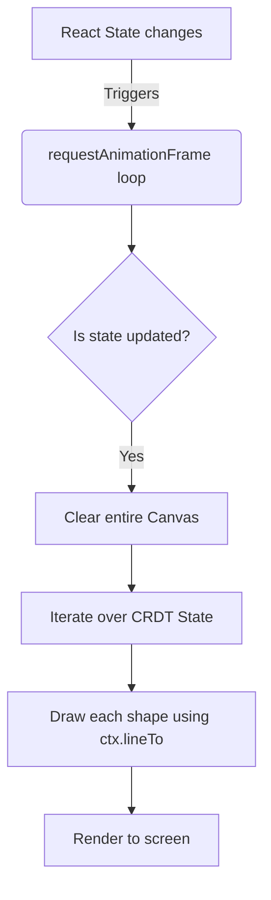
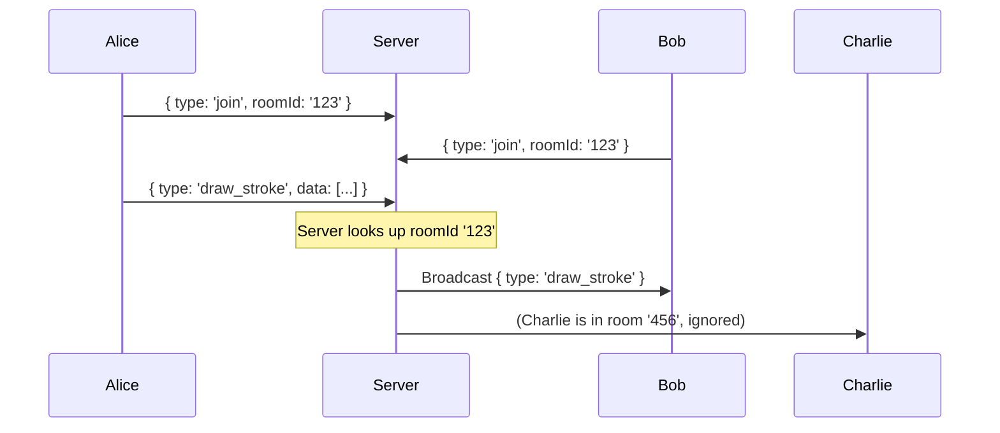

# Lesson 2: HTML5 Canvas & WebSockets

> **Goal**: Before implementing complex synchronization algorithms (CRDTs), we need a performant foundation. This lesson explains why we use immediate-mode rendering (Canvas) instead of the DOM, and why we need full-duplex communication (WebSockets) instead of standard HTTP.

---

## Table of Contents

1. [The Core Problem](#the-core-problem)
2. [ELI12: The Flipbook & The Telephone](#eli12-the-flipbook--the-telephone)
3. [University: Rendering Pipelines & Network Protocols](#university-rendering-pipelines--network-protocols)
4. [Industry: How Real Products Handle This](#industry-how-real-products-handle-this)
5. [How Figma Solves It](#how-figma-solves-it)
6. [How We Simplify It](#how-we-simplify-it)
7. [Architecture](#architecture)
8. [Canvas vs SVG/DOM — Deep Dive](#canvas-vs-svgdom--deep-dive)
9. [WebSockets vs HTTP — Deep Dive](#websockets-vs-http--deep-dive)
10. [Exercises](#exercises)
11. [Quiz](#quiz)
12. [Interview Questions](#interview-questions)
13. [Cheat Sheet](#cheat-sheet)

---

## The Core Problem

We are building a highly interactive, real-time application. This introduces two major engineering hurdles that typical web applications do not face:

1. **Rendering Performance**: Standard React apps create `<div>` elements for everything. If multiple users draw thousands of complex shapes, the browser will crash trying to manage the DOM tree. We need a way to draw raw pixels efficiently.
2. **Real-time Latency**: Standard web apps use HTTP, where the client *asks* the server for data. In a collaborative app, the server must *push* data to the client instantly the moment another user moves their cursor. Waiting for the client to ask is too slow.

---

## ELI12: The Flipbook & The Telephone

### Rendering (Canvas vs DOM)
> *Imagine you want to show someone a busy city street.*

**Retained Mode (DOM/SVG)**: You build a highly detailed diorama using action figures. If a car moves, you physically grab the car and move it. As the city grows, you have thousands of action figures, and finding the right one to move becomes incredibly slow.

**Immediate Mode (Canvas)**: You draw a single frame of the city on a piece of paper, show it, throw it away, and instantly draw the next frame showing the car moved slightly forward (like a flipbook). You don't "remember" the car; you just color pixels. It's incredibly fast, even with millions of details.

### Networking (WebSockets vs HTTP)
> *Imagine you want to know when your friend gets home.*

**HTTP (Polling)**: You send a letter to your friend: "Are you home?". They reply: "No." You send another letter: "Are you home?". They reply: "No." You do this every 5 seconds. It's exhausting and wastes a lot of paper.

**WebSockets**: You call your friend on the telephone and *keep the line open*. You both stay on the line in silence. The second they walk in the door, they speak into the phone: "I'm home!" Instant communication, no wasted letters.

---

## University: Rendering Pipelines & Network Protocols

### The Browser Rendering Pipeline (DOM/SVG)

When a browser renders a standard web page, it goes through a heavy pipeline:
`Parse HTML → Construct DOM Tree → Parse CSS → Construct CSSOM → Render Tree → Layout (Reflow) → Paint → Composite`

If you have 10,000 shapes (like a complex whiteboard) and you move *one* shape, the browser often has to recalculate the Layout and Paint phases for the entire tree. This causes jank and dropped frames (below 60FPS).

### Immediate-Mode Rendering (Canvas)

The `<canvas>` element bypasses the DOM tree for its contents. You are given a `CanvasRenderingContext2D` (or WebGL context). 
- You issue raw drawing commands: `ctx.lineTo(x, y)`, `ctx.fill()`.
- The browser executes these commands directly into a bitmap memory buffer.
- On the next screen refresh, that single bitmap is composited onto the screen.
- **Tradeoff**: The browser has no idea what you drew. There are no click events on shapes, no accessibility by default, and no CSS styling. You must build your own "hit detection" to know if a user clicked a shape.

### Network Protocols: Layer 7

**HTTP/1.1**: Stateless, request-response. Overhead includes TCP handshake, HTTP headers, and connection closing.
**HTTP Long-Polling**: Client requests data. Server holds the request open until data is available, then responds. Client immediately requests again. (High latency, high server overhead).
**Server-Sent Events (SSE)**: Unidirectional (Server → Client). Good for live feeds, but clients still need standard HTTP to send data back.
**WebSockets**: Bi-directional, full-duplex TCP connection. After an initial HTTP handshake (the `Upgrade` header), the protocol switches to WebSockets. Both sides can send binary or text frames at any time with minimal overhead (just 2-10 bytes of framing).

---

## Industry: How Real Products Handle This

### Figma 
- **Rendering**: Figma was famously one of the first major apps to completely bypass the DOM. They built a custom rendering engine using **WebGL / WebAssembly** via C++. 
- **Networking**: WebSockets for real-time multiplayer synchronization.

### Excalidraw
- **Rendering**: Excalidraw uses **HTML5 Canvas (2D Context)**. They redraw the entire canvas on every frame (using `requestAnimationFrame`). It is highly optimized but simpler than Figma's WebGL approach.
- **Networking**: WebSockets, facilitated by Socket.io in earlier versions.

### Google Docs
- **Rendering**: Originally DOM-based (using `contenteditable`), Google Docs recently transitioned to a custom Canvas-based renderer to ensure perfect pixel alignment across all browsers and devices.
- **Networking**: Custom polling/WebSocket hybrid, prioritizing reliability.

---

## How Figma Solves It

Figma realized that to build a design tool in the browser, DOM manipulation was a non-starter. 

1. **WebAssembly**: They compiled a C++ rendering engine to WebAssembly.
2. **WebGL**: They use WebGL (a JavaScript API for rendering interactive 2D and 3D graphics) which talks directly to the GPU, bypassing the browser's 2D canvas limits.
3. **Dirty Rectangles**: Figma doesn't redraw the entire screen on every frame. If you move a small icon in the corner, Figma calculates the exact bounding box of that change (the "dirty rectangle") and only re-renders those specific pixels.

---

## How We Simplify It

We will closely model **Excalidraw's** approach:

1. **Rendering**: We use the standard **HTML5 Canvas 2D API** (`CanvasRenderingContext2D`). It is fast enough for our needs (thousands of shapes) without the immense complexity of WebGL.
2. **Redraw Strategy**: For now, we will clear the entire canvas and redraw every shape from scratch on every `requestAnimationFrame`. As we scale, we can introduce Dirty Rectangles.
3. **Networking**: We use the raw **`ws` library** in Node.js. No Socket.io, no magic. This teaches us the raw WebSocket protocol.

---

## Architecture

### The Canvas Engine (`CanvasEngine.ts`)



### The WebSocket Room Manager (`RoomManager.ts`)



---

## Canvas vs SVG/DOM — Deep Dive

| Feature | SVG / DOM | Canvas (2D) | WebGL |
|---|---|---|---|
| **Mode** | Retained Mode | Immediate Mode | Immediate Mode (GPU) |
| **Max Objects** | ~1,000 before lag | ~10,000+ | ~1,000,000+ |
| **Event Handling** | Built-in (`onClick`) | Manual (Hit testing) | Manual |
| **Resolution** | Infinite (Vector) | Fixed (Rasterized) | Fixed |
| **Complexity** | Low | Medium | Very High |
| **Our Choice** | ❌ Too slow | ✅ Sweet spot | ❌ Too complex for MVP |

**Handling High DPI (Retina) Displays with Canvas:**
A common pitfall with Canvas is blurry text and lines on modern displays. This happens because a CSS pixel does not equal a physical screen pixel. We fix this in `CanvasEngine.ts` by checking `window.devicePixelRatio`. If it's `2`, we multiply the canvas `width` and `height` properties by 2, but keep the CSS `width` and `height` the same, effectively packing 4x the pixels into the same physical space.

---

## WebSockets vs HTTP — Deep Dive

The WebSocket handshake looks exactly like an HTTP request, but with an `Upgrade` header:

**Client Request:**
```http
GET /chat HTTP/1.1
Host: server.example.com
Upgrade: websocket
Connection: Upgrade
Sec-WebSocket-Key: dGhlIHNhbXBsZSBub25jZQ==
Sec-WebSocket-Version: 13
```

**Server Response:**
```http
HTTP/1.1 101 Switching Protocols
Upgrade: websocket
Connection: Upgrade
Sec-WebSocket-Accept: s3pPLMBiTxaQ9kYGzzhZRbK+xOo=
```

Once this handshake completes, the connection stays open. Data is framed into small packets. Because there are no HTTP headers attached to every message, sending a mouse coordinate takes only a few bytes, allowing us to transmit 60 updates per second without saturating the network.

---

## Exercises

### Exercise 1: Hit Testing
In a DOM-based app, you can add an `onClick` handler to a `<div>` to know when it was clicked. In a Canvas app, you only have a single `<canvas>` element. 
If a user clicks the canvas at coordinates `(x: 100, y: 150)`, write pseudocode to determine if they clicked inside a specific rectangle (which is stored in your state as `rect = {x: 90, y: 140, w: 50, h: 50}`).

### Exercise 2: Scaling
Your WebSocket server currently keeps all connections in memory (`Map<roomId, Set<WebSocket>>`). 
Imagine your app goes viral, and you need to run 5 backend servers behind a load balancer. 
Alice connects to Server 1. Bob connects to Server 2. Both join "Room A". 
When Alice draws, Server 1 receives the message. How does Server 1 ensure Bob receives it? (Hint: Research Redis Pub/Sub).

### Exercise 3: The Event Loop
Why do we use `requestAnimationFrame` instead of `setInterval(render, 16)` to achieve 60FPS?

---

## Quiz

Test your understanding. Try to answer without scrolling up.

**Q1**: Why did Figma and Google Docs move away from the DOM to Canvas/WebGL?

<details>
<summary>Answer</summary>

Because the browser's DOM rendering pipeline (layout, reflow, paint, composite) is too slow and memory-intensive to handle thousands of constantly changing elements. Canvas/WebGL provide raw pixel drawing capabilities bypassing this overhead.
</details>

**Q2**: What does "Retained Mode" vs "Immediate Mode" mean in rendering?

<details>
<summary>Answer</summary>

**Retained Mode (DOM)**: The browser remembers the objects (nodes) you create. If you change a property, the browser knows how to redraw it.
**Immediate Mode (Canvas)**: The browser remembers nothing. You issue draw commands directly to pixels. You must manually clear and redraw the entire scene when something changes.
</details>

**Q3**: Why is HTTP Polling bad for real-time collaboration?

<details>
<summary>Answer</summary>

It creates immense overhead. The client has to constantly ask "Any updates?", creating heavy network traffic and server load (HTTP headers, TCP handshakes). It also introduces artificial latency (you only get the update on the next poll interval).
</details>

**Q4**: How do you fix a blurry HTML5 Canvas on a Retina display?

<details>
<summary>Answer</summary>

You must scale the canvas internal resolution (`canvas.width`, `canvas.height`) by the `window.devicePixelRatio`, while keeping the CSS dimensions (`style.width`, `style.height`) fixed. You then apply a `ctx.scale()` transform to scale all draw operations up.
</details>

---

## Interview Questions

### Conceptual

1. **"What is the difference between WebSockets and Server-Sent Events (SSE)?"**
   - WebSockets are full-duplex (two-way). The client can send data directly to the server over the same socket. SSE is unidirectional (Server to Client only); the client must make standard HTTP POST requests to send data back.

2. **"Explain how you would handle object selection (clicking a shape) in an HTML5 Canvas application."**
   - Since Canvas has no DOM nodes, you must perform mathematical hit-testing. On a click event, capture the `(x, y)` coordinates, iterate through your state array in reverse (top-most shapes first), and check if the point intersects the mathematical bounding box of the shape.

### System Design

3. **"Design the backend for a real-time collaborative whiteboard that supports 100,000 concurrent users."**
   - Key concepts to mention: Sticky sessions vs stateless WebSocket servers. Using a Pub/Sub mechanism (like Redis or Kafka) to route room broadcasts across multiple Node.js server instances. Handling disconnects and reconnections gracefully.

### Coding

4. **"Write a function that calculates if a point (x, y) is inside a circle (cx, cy, radius)."**
   - *Solution*: Use the Pythagorean theorem to calculate the distance between the point and the center. If the distance is less than or equal to the radius, it's a hit. `Math.sqrt((x-cx)**2 + (y-cy)**2) <= radius`.

---

## Cheat Sheet

```
┌─────────────────────────────────────────────────────────────┐
│                    LESSON 2 CHEAT SHEET                      │
├─────────────────────────────────────────────────────────────┤
│                                                             │
│  Rendering Paradigms:                                       │
│    DOM/SVG  → Retained Mode. Browser manages objects. Slow. │
│    Canvas   → Immediate Mode. You manage pixels. Fast.      │
│                                                             │
│  Canvas Performance Loop:                                   │
│    requestAnimationFrame(render)                            │
│    -> ctx.clearRect()                                       │
│    -> draw everything from state                            │
│                                                             │
│  High DPI Canvas Fix:                                       │
│    canvas.width = cssWidth * devicePixelRatio               │
│    ctx.scale(devicePixelRatio, devicePixelRatio)            │
│                                                             │
│  Networking:                                                │
│    HTTP     → Request/Response. Bad for real-time.          │
│    Polling  → "Are we there yet?" High overhead/latency.    │
│    SSE      → One-way (Server pushes to client).            │
│    WebSocket→ Two-way, persistent TCP connection.           │
│                                                             │
│  Room Management:                                           │
│    Server maintains Map<roomId, Set<WebSocket>>.            │
│    When message received for Room X, iterate over Set       │
│    and send() to all peers except sender.                   │
│                                                             │
└─────────────────────────────────────────────────────────────┘
```

---

## What's Next?

**Lesson 3: Building the CRDT Engine**  
Now that we have a blazing fast canvas and real-time networking, we face the final boss: Conflicts. Next lesson, we will implement the `LWW-Register` (Last Writer Wins) and `LWW-Element-Set` algorithms to seamlessly sync state across all connected clients without data loss.

---

> *"There are only two hard things in Computer Science: cache invalidation and naming things."*  
> — Phil Karlton  
> *(And distributed state synchronization over lossy networks).*
