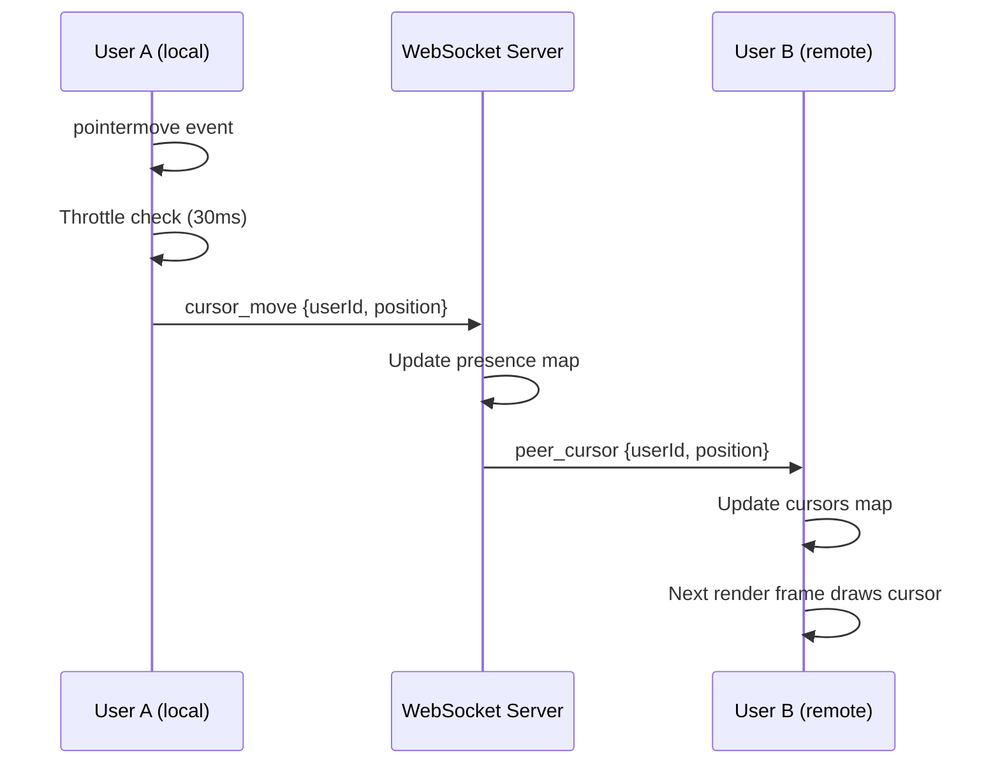
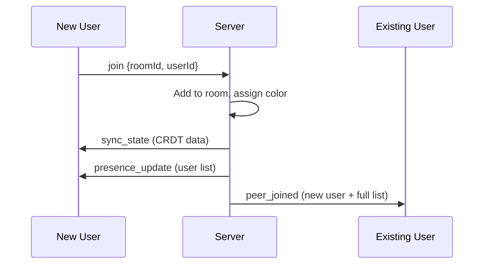

# Lesson 4: Presence & Live Cursors

> **What you'll learn**: How to implement "who's online" indicators and live cursor tracking — the features that make collaborative apps *feel* real-time.

---

## ELI12 (Explain Like I'm 12)

Imagine you're in a Google Doc with your friend. You can see their cursor blinking and moving around as they type. That little colored cursor tells you:

1. **They're online** — you're not alone
2. **Where they are** — you can see what they're looking at
3. **That the app is alive** — things are happening in real-time

This is called **presence**. It's the feeling that other humans are *here* with you.

---

## University Level: Ephemeral vs. Persistent State

In our whiteboard, we have two fundamentally different types of data:

### Persistent State (CRDT-managed)
- **Shapes/strokes** drawn on the canvas
- Must survive disconnections, page refreshes, server restarts
- Needs conflict resolution (what if two people edit the same shape?)
- Uses CRDTs (LWW-Register, LWW-Element-Set)

### Ephemeral State (NOT CRDT-managed)
- **Cursor positions** — where is each user's mouse right now?
- **Online status** — who is currently connected?
- Does NOT need to survive disconnections (if you disconnect, your cursor should *disappear*)
- Does NOT need conflict resolution (latest value always wins by definition)

This distinction matters because it affects our architecture:

```
┌─────────────────────────────────────────────────┐
│                  State Types                     │
├──────────────────────┬──────────────────────────┤
│   Persistent (CRDT)  │   Ephemeral (Presence)   │
│   ─────────────────  │   ──────────────────────  │
│   Shapes, strokes    │   Cursor positions        │
│   Colors, text       │   Online/offline status   │
│   Z-ordering         │   Typing indicators       │
│   Survives refresh   │   Lost on disconnect      │
│   Needs merge logic  │   Latest value wins       │
│   Stored in DB       │   In-memory only          │
└──────────────────────┴──────────────────────────┘
```

---

## Industry: How Figma Does It

Figma's presence system handles millions of concurrent cursors across thousands of documents. Their approach:

1. **Cursor events are throttled** — Figma doesn't send every single mouse move event. They sample at a reasonable rate (~30-60fps) and interpolate on the receiving end.

2. **Presence is server-managed** — The server maintains the canonical list of who's in each document. Clients don't try to track this themselves.

3. **Colors are deterministic** — Each user gets a color based on their join order, not random assignment. This ensures consistency across all clients.

4. **Cursors have "rooms"** — You only see cursors from people in the same page/frame as you.

---

## How We Simplified It

| Figma | Our Whiteboard |
|---|---|
| Cursor interpolation for smooth animation | Direct position rendering (simpler) |
| Heartbeat-based online detection | WebSocket `close` event = offline |
| Per-page cursor scoping | Single canvas, all cursors visible |
| Custom binary protocol | JSON over WebSocket |
| Edge servers worldwide | Single local server |

---

## Architecture

### Data Flow: Cursor Movement



### Data Flow: Join/Leave



---

## The Code

### Backend: RoomManager Presence Tracking

The `RoomManager` now maintains three maps per room:

```typescript
// Who's connected?
private rooms: Map<string, Set<WebSocket>>

// WebSocket → userId mapping (for cleanup on disconnect)
private clientInfo: Map<WebSocket, { roomId: string; userId: string }>

// Who's online and where are their cursors?
private roomPresence: Map<string, Map<string, UserPresence>>
```

When a user joins, they're assigned a color from a rotating palette:

```typescript
const PEER_COLORS = [
  '#f38ba8', // red/pink
  '#a6e3a1', // green
  '#fab387', // peach
  '#89dceb', // teal
  '#cba6f7', // mauve
  // ...
];
```

### Frontend: The usePresence Hook

The `usePresence` hook is a clean separation of concerns:

```typescript
const { peers, emitCursor } = usePresence(wsClient, ROOM_ID, USER_ID);
```

- `peers`: A `Map<string, UserPresence>` of all online users (excluding yourself)
- `emitCursor(position)`: Call on pointer move — internally throttled to ~33fps

### Cursor Throttling

Without throttling, a user moving their mouse at 60fps would send 60 WebSocket messages per second. With 10 users in a room, that's 600 messages/second of cursor data alone.

Our throttle is simple:

```typescript
const CURSOR_THROTTLE_MS = 30; // ~33fps

const emitCursor = (position: Point) => {
  const now = Date.now();
  if (now - lastEmitRef.current < CURSOR_THROTTLE_MS) return;
  lastEmitRef.current = now;
  ws.sendMessage({ type: 'cursor_move', ... });
};
```

### Canvas: Drawing Cursors

Each cursor is rendered as a colored pointer arrow + name badge:

```
  ╱
 ╱  ← colored pointer (triangle)
╱
 ┌──────────┐
 │ Preeti   │ ← rounded badge with user's color
 └──────────┘
```

This is drawn every frame by the `CanvasEngine.drawCursors()` method, using the 2D Canvas API to draw a triangle path and a rounded rectangle.

---

## Key Takeaways

1. **Not all real-time data needs CRDTs** — Cursors are "last-writer-wins by nature" and don't need convergence guarantees.
2. **Throttle aggressively** — Network bandwidth is a shared resource. 30ms throttle = smooth enough for humans.
3. **Server is the source of truth for presence** — Don't try to have clients maintain their own peer lists.
4. **Colors should be deterministic** — Assigning colors server-side ensures everyone sees the same colors for the same users.
5. **Separation of concerns** — The `usePresence` hook knows nothing about drawing. The `CanvasEngine` knows nothing about WebSockets.

