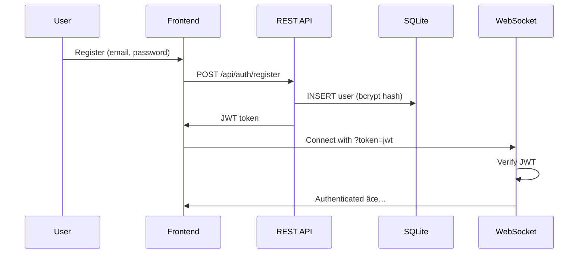

# Lesson 7: Authentication & Export

> **Concepts**: JWT (JSON Web Tokens), bcrypt password hashing, stateless auth, WebSocket authentication, file export formats

---

## ELI12

Imagine you have a secret clubhouse (the whiteboard room). Anyone can walk in and start drawing. But what if you want to know *who* is drawing? You give each person a membership card (JWT) when they sign up. Every time they come in, they show their card, and you know who they are without having to remember every face.

The card has their name written inside, and it's sealed with a special stamp that only you can make — so nobody can fake a card.

---

## University Level

### JWT (JSON Web Tokens)

A JWT is a compact, URL-safe token consisting of three Base64-encoded parts separated by dots:

```
header.payload.signature
```

- **Header**: Algorithm and token type (`{"alg": "HS256", "typ": "JWT"}`)
- **Payload**: Claims — userId, displayName, email, expiry time
- **Signature**: `HMAC-SHA256(base64(header) + "." + base64(payload), secret)`

**Key property**: The server can verify a token's authenticity and read its claims WITHOUT storing any session state. This is why JWTs are called "stateless" authentication.

### bcrypt

bcrypt is a password hashing function designed to be intentionally slow:

1. Generate a random **salt** (22 characters)
2. Hash the password + salt using Blowfish cipher, repeated `2^cost` times
3. Store the salt + hash together in a single string

Why slow? If an attacker steals your database, they need to hash billions of guesses. bcrypt's configurable "cost factor" (we use 12, meaning 2^12 = 4096 iterations) makes each guess take ~250ms, making brute force impractical.

### WebSocket Authentication

The browser WebSocket API doesn't support custom headers. So how do we authenticate?

| Approach | Pros | Cons |
|---|---|---|
| **Query parameter** `?token=jwt` | Simple, widely used | Token visible in server logs |
| **First message** after connect | Clean separation | Race condition window |
| **Cookie** | Automatic | CORS complexity |

We use query parameters — the same approach used by Socket.io, Pusher, and Firebase.

---

## Industry: How Figma Does It

Figma uses OAuth2 for authentication and issues session tokens. Their real-time layer (LiveGraph) authenticates WebSocket connections via a session cookie that's set during the HTTP login flow. They use a custom binary protocol over WebSocket, not JSON.

For export, Figma renders frames server-side using their C++ rendering engine (compiled to WebAssembly for the browser). This gives pixel-perfect exports in PNG, SVG, and PDF.

---

## How We Simplify It

| Figma | Our Approach |
|---|---|
| OAuth2 + session cookies | JWT via query params |
| Server-side rendering for export | Client-side canvas.toBlob() for PNG |
| C++/WASM rendering → SVG | Manual shape-to-SVG reconstruction |
| Custom binary protocol | JSON over WebSocket |

Our approach is simpler but teaches the same core concepts: stateless auth, token validation, and multi-format export.

---

## Architecture



### Export Architecture

```mermaid
graph LR
    STATE[CRDT State] --> PNG[canvas.toBlob → PNG]
    STATE --> SVG[Shape → SVG elements]
    STATE --> JSON[state.toJSON → JSON]
```



---

## Code Changes

### Backend
- `backend/src/auth/AuthController.ts` — REST endpoints for `/register` and `/login`
- `backend/src/auth/AuthMiddleware.ts` — JWT verification for WebSocket upgrade
- `backend/src/storage/UserStore.ts` — SQLite table for user accounts
- `backend/src/index.ts` — Express app with CORS, JSON parsing, auth routes
- `backend/src/network/WebSocketServer.ts` — JWT extraction from `?token=` query param

### Frontend
- `frontend/src/ui/AuthScreen.tsx` + `.css` — Login/Register form
- `frontend/src/ui/ExportMenu.tsx` + `.css` — PNG/SVG/JSON export dropdown
- `frontend/src/App.tsx` — Auth routing (AuthScreen vs CanvasBoard)
- `frontend/src/ui/CanvasBoard.tsx` — Accepts auth props, passes token to WS

---

## Key Takeaways

1. **JWTs are stateless** — any server can validate them independently (critical for horizontal scaling)
2. **bcrypt is intentionally slow** — this is a feature, not a bug
3. **WebSocket auth via query params** is the industry standard workaround for the missing header API
4. **Export is a rendering problem** — PNG uses the canvas directly, SVG requires reconstructing the scene graph
5. **Guest access** alongside auth makes development faster while keeping the auth system real

---

> Next: Undo/Redo with CRDTs (future lesson on operation logs and vector clocks)

